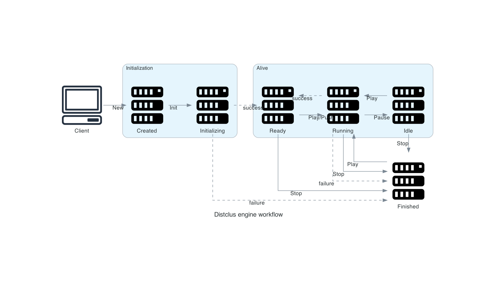

# Distclus

> Multi-threaded online distance based clustering library

## Introduction

This library implements the concepts and theoretical results described in the article https://hal.inria.fr/hal-01264233.

In addition, static and dynamic concerns aim to address multi-platform cross-usages, from large to embedded scales.

## Requirements

[Golang](https://golang.org/doc/install)

## Installation

### With internet

#### Outside go file:

```
# install all artefacts, verbose and update if necessary
go get -u -v github.com/wearelumenai/distclus/...
# or only streaming
go get -u -v github.com/wearelumenai/streaming
```

#### Inside go file:

```go
// import only mcmc algo and dtw space
import (
	"github.com/wearelumenai/distclus/mcmc"
	"github.com/wearelumenai/distclus/dtw"
)

```

### Packaging

1. Get a release here: https://github.com/wearelumenai/distclus/releases
2. Uncompress it and tape `go get -v ./...` inside

## Test

```
$ make test
```

## Main abstractions

The distclus library intend to be polymorphic :
any element type can be used provided a distance and a barycenter can be computed between 2 elements.

A data type that can be clustered must implement the ```core.Elemt``` interface.
Distance and barycenter are calculated using a suitable object that implements ```core.Space```.

An algorithm is represented by an ```core.OnlineClust``` interface object, composed of two interfaces: the controller `core.OCCtrl` and the model `core.OCModel`.
Actually several algorithm are provided by the library and more can be implemented by providing a specific
implementation to the ```core.OnlineClust``` object.

```go
package core

type OnlineClust interface {
	OCCtrl
	OCModel
}

// OCModel online clustering model
type OCModel interface {
	Centroids() Clust               // clustering result
	Conf() Conf                     // algo conf
	Impl() Impl                     // algo impl
	Space() Space                   // data space
	Status() OCStatus               // algo status
	RuntimeFigures() RuntimeFigures // clustering figures
}

// OCCtrl online clustring controller
type OCCtrl interface {
	Init() error // initialize algo centroids with impl strategy
	Play() error // play (with x iterations if given, otherwise depends on conf.Iter/conf.IterPerData, and maximal duration in ns if given, otherwise conf.Timeout) the algorithm
	Pause() error // pause the algorithm (idle)
	Wait(Finishing, time.Duration) error // wait for finishing condition and maximal duration. By default, finishing is ready/idle/finished status, and duration is infinite
	Stop() error // stop the algorithm
	Push(Elemt) error // add element
	Predict(elemt Elemt) (Elemt, int, float64) // input elemt centroid/label with distance to closest centroid
	Batch() error // execute (x iterations if given, otherwise depends on conf.Iter/conf.IterPerData) in batch mode (do play, wait, then stop)
	Copy(Conf, Space) (OnlineClust, error) // make a copy of this algo with new configuration and space
}
```

An implementation is an objects that respects the ```core.Impl``` interface.

Three implementations are provided :
 - kmeans is built with the ```kmeans.NewAlgo``` constructor
 - mcmc is built with the ```mcmc.NewAlgo``` constructor
 - streaming is built with the ```streaming.NewAlgo``` constructor

Constructors need at least :
 - a configuration object which holds the algorithm parameters
 - a ```core.Space``` object used for distance and center computations

The result of a clustering is of type ```core.Clust``` which is an array of ```core.Elemt``` with dedicated methods.

### OC Workflow

An `OnlineClust` object lives in three main states through 6 `core.ClustStatus` :

- `Initialization`: implementation initialization step. This step is implicit if the user call the method `Play` after created the algorithm
- `Alive`: the algorithm do implementation iterations depending on `CtrlConf.Iter` or pushed data with `CtrlConf.IterPerData` and `CtrlConf.DataPerIter` values (specification is in the next section)
- `Finished`: leave alive status after `Stop` command, or when an error occured from `Initializing` status



## Configuration

Algorithms are configured with configuration objects.

All algorithm configurations implement the `core.Conf` which are prepated with the function `PrepareConf` before initializing the algorithm and change configuration:

```go
package core

type Conf interface {
	Verify() error // verify configuration values
	Ctrl() *CtrlConf // controller configuration
	SetDefaultValues() // Set default values
}

type CtrlConf struct {
	Iter           int
	IterFreq       float64
    Timeout        float64
    NumCPU         int
    DataPerIter   int
	StatusNotifier StatusNotifier
	Finishing Finishing
}

// PrepareConf before using it in algo
func PrepareConf(conf Conf) (err error) {
	conf.SetDefaultValues()
	conf.Ctrl().SetDefaultValues()
	err = conf.Verify()
	if err == nil {
		err = conf.Ctrl().Verify()
	}
	return
}
```

Where :

- `Iter`: maximal number of iterations if given. 0 by default. Infinite if negative.
- `IterFreq`: maximal number of iterations per second. Unlimited by default. If > 0, set algorithm to status `Sleeping` during execution temporization.
- `Timeout`: maximal algorithm execution duration in seconds. Unlimited by default.
- `NumCPU`: number of CPU to use for algorithm execution. Default is maximal number of CPU.
- `DataPerIter`: minimum number of pushed data before starting a new iteration if given. Online clustering specific.
- `StatusNotifier`: asynchronous callback called each time the algorithm change of status or fires an error.
- `Finishing`: `core.Finishing` interface providing the finishing condition method `IsFinished(OCModel) bool` which indicates to the algorithm to stop iterations. You can use

### MCMC Configuration

A minimal configuration for the MCMC algorithm requires
two objects, one for the Metropolis Hastings and the other for the alteration distribution:

```go
package main

import "github.com/wearelumenai/distclus/mcmc"

var conf = mcmc.Conf{
	InitK: 1,
	Amp:   .5,
	B:     1,
    Conf:  core.CtrlConf{
      Iter: 1000,
    }
}

var tConf = mcmc.MultivTConf{
	Dim:   2,
	Nu:    3,
}
```

where :
 - ```InitK``` is the starting number of clusters
 - ```Amp``` and ```B``` are used in the Metropolis Hastings accept ratio computation
 - ```Dim``` and ```Nu``` are used by the alteration distribution

For more information on setting these parameters refer to https://hal.inria.fr/hal-01264233.

## Build the algorithm

The algorithm is built using the ```mcmc.NewAlgo``` function. It takes the following parameters :
 - ```conf mcmc.Conf``` : configuration object
 - ```space core.Space``` : distance and barycenter computation
 - ```data []core.Elemt``` : observations known at build time if any (```nil``` otherwise)
 - ```initializer kmeans.Initializer``` : a functor that returns the starting centers
 - ```distrib mcmc.Distrib``` : alteration distribution

 ```go
package main

import (
	"github.com/wearelumenai/distclus/core"
	"github.com/wearelumenai/distclus/euclid"
	"github.com/wearelumenai/distclus/kmeans"
	"github.com/wearelumenai/distclus/mcmc"
)

func Build(conf mcmc.Conf, tConf mcmc.MultivTConf) (algo *core.Algo, space core.Space) {
	space = euclid.NewSpace(euclid.Conf{})
	var distrib = mcmc.NewMultivT(tConf) // the alteration distribution
	algo = mcmc.NewAlgo(conf, space, nil, kmeans.PPInitializer, distrib)
	return
}
```

## Run and feed

The algorithm can be run in two modes :
 - `batch` : all data might be pushed before starting the algorithm.
 - `online` : further data can be pushed after the algorithm is started, and dynamic functionalities are given for interacting continuously with the clustering

The following function starts the algorithm in online mode then pushes the observations

```go
package main

import (
	"github.com/wearelumenai/distclus/core"
)

func RunAndFeed(algo *core.Algo, observations []core.Elemt) (err error) {
	for i := 0; i < len(observations) && err == nil; i++ {
		err = algo.Push(observations[i])
	}
	err = algo.Batch() // run the algorithm in batch mode
	return
}
```

## Prediction

Once the algorithm is started, either in batch or online mode,
the ```Predict``` method can be used to make predictions.
The following function uses predictions to calculate the root mean squared error
for observations for which real output is known.

```go
package main

import (
	"github.com/wearelumenai/distclus/core"
	"math"
)

func RMSE(algo *core.Algo, observations []core.Elemt, output []core.Elemt, space core.Space) float64 {
	var mse = 0.
	for i := range observations {
		var _, _, dist, _ = algo.Predict(observations[i])
		mse += dist * dist / float64(len(observations))
	}
	return math.Sqrt(mse)
}
```

The following functions help in evaluating the algorithm.
The ```core.Clust``` object method ```MapLabel``` is used to compute the real output (see below: Advanced usage).

```go
package main

import (
	"github.com/wearelumenai/distclus/core"
)

func Eval(algo *core.Algo, centers core.Clust, observations []core.Elemt, space core.Space) (result core.Clust, rmse float64, err error) {
	var output = getOutput(centers, observations, space)
	rmse = RMSE(algo, observations, output, space)
	result, err = algo.Centroids()
	return
}

func getOutput(centers core.Clust, observations []core.Elemt, space core.Space) (output []core.Elemt) {
	var labels = centers.MapLabel(observations, space)
	output = make([]core.Elemt, len(labels))
	for i := range labels {
		output[i] = centers[labels[i]]
	}
	return
}
```

## Sample data

For testing purpose we need data.
The following function returns real centers with the given number of sample observations.

```go
package main

import (
	"github.com/wearelumenai/distclus/core"
	"golang.org/x/exp/rand"
)

func Sample(n int) (centers core.Clust, observations []core.Elemt) {
	centers = core.Clust(
		[]core.Elemt{
			[]float64{1.4, 0.7},
			[]float64{7.6, 7.6},
		})
	observations = make([]core.Elemt, n)
	for i := range observations {
		var obs = make([]float64, 2)
		if rand.Intn(2) == 1 {
			copy(obs, centers[0].([]float64))
		} else {
			copy(obs, centers[1].([]float64))
		}
		for j := range obs {
			obs[j] += rand.Float64() - 1
		}
		observations[i] = obs
	}
	return
}
```

## Putting all together

We will now glue the pieces we have built so far. The algorithm must be closed to stop online execution if necessary.
In the following example it is deferred to the end of the function.

```go
package main

import (
	"fmt"
	"time"
)

func Example() {
	var centers, observations = Sample(1000)
	var train, test = observations[:800], observations[800:]

	var algo, space = Build(conf, tConf)
	defer algo.Close()

	var errRun = RunAndFeed(algo, train)

	if errRun == nil {
		var result, rmse, errEval = Eval(algo, centers, test, space)
		fmt.Printf("%v %v %v\n", len(result) < 4, rmse < 1, errEval)
	}
	// Output: true true <nil>
}
```

## Advanced usage

### ```core.Clust``` struct
Given clustering centers, it is possible to obtain internal loss and cardinality for each cluster :

```go
var space = euclid.NewSpace(euclid.Conf{})
var norm = 2.0
var losses, cards = centers.ReduceLoss(observations, space, norm)
```

The same could be performed in parallel :
```go
var space = euclid.NewSpace(euclid.Conf{})
var norm = 2.0
var degree = runtime.NumCPU()
var losses, cards = centers.ParReduceLoss(observations, space, norm)
```

In some cases you'll want to predict labels upon fixed cluster centers :
```go
var space = euclid.NewSpace(euclid.Conf{})
var labels = centers.ParMapLabel(observations, space, norm)
```
This is useful when the clustering is done online because the centers are continually changing.

### `core.OnlineClust` interface (core/algo.go)

The `core.OnlineClust` interface is implemented by the `core.Algo` struct.

Is is composed of two interfaces:

#### `core.OCModel` interface (core/model.go)

- `Centroids() Clust`: get array of clustering centroids
- `Conf() ImplConf`: get implementation configuration
- `Impl() Impl`: get implementation
- `Space() Space`: get space
- `Status() core.OCStatus`: get algo status (Status and Error if failed)
- `RuntimeFigures() RuntimeFigures`: algorithm figures of type `map[string]float64`

#### `core.OCCtrl` interface (core/ctrl.go)

- `Init() error`: initialize the algorithm with implentation strategy (random, given, kmeans++, ...)
- `Play() error`: execute the algorithm, with specific `Finishing` and timeout duration if given
- `Pause() error`: pause execution. Use methods `Play` or `Stop` to exit this state
- `Wait(Finishing, time.Duration) error`: wait until algorithm terminates finish its execution, with specific `Finishing` and timeout duration if >= 0
- `Stop() error`: stop execution and status become `Finished`. Play back is possible
- `Push(elemt Elemt) error`: push an element
- `Predict(elemt Elemt) (Elemt, int, float64)`: according to previous method, get centroid, its index and minimal distance with closest centroid in array of clustering centroids for input elemt
- `Batch() error` execute the algorithm in batch mode. Similar to the call sequence of `Play` and `Wait`, with specific `Finishing` and timeout duration if given
- `Copy(ImplConf, Space) (OnlineClust, error)`: return a copy of this algorithm with entire execution context

#### Online clustering workflow

An `OnlineClust` object lives in three main states through 6 `core.ClustStatus` :

- Initialization: implementation initialization step. This step is implicit if the user call the method `Play` after created the algorithm
- Alive: the algorithm do implementation iterations depending on `CtrlConf.Iter` or pushed data with `CtrlConf.IterPerData` and `CtrlConf.DataPerIter` values (specification is in the next section)
- Finished: leave alive status after `Stop` command, or when an error occured from `Initializing` status


### ```mcmc.LateDistrib``` struct

The ```mcmc.MutlivT``` implements a multivariate T distribution. The dimension of the data must be known and set
in the ```mcmc.MultivTConf``` configuration object. In some situation this information is not known until the first
data arrives. This can be handled using a ```LateDistrib``` instance. It implements the ```Distrib``` interface and
its responsibility is to initialize and wrap another ```Distrib``` instance. The ```Build``` function above
may be modified like this:
```go
package main

import (
	"github.com/wearelumenai/distclus/core"
	"github.com/wearelumenai/distclus/euclid"
	"github.com/wearelumenai/distclus/kmeans"
	"github.com/wearelumenai/distclus/mcmc"
)

func Build(conf mcmc.Conf, tConf mcmc.MultivTConf, data []core.Elemt) (algo *core.Algo, space euclid.Space) {
	space = euclid.NewSpace(euclid.Conf{})
	var buildDistrib = func(data core.Elemt) mcmc.Distrib {
		tConf.Dim = space.Dim([]core.Elemt{data})
		return mcmc.NewMultivT(tConf)
	}
	var distrib = mcmc.NewLateDistrib(buildDistrib) // the alteration distribution
	algo = mcmc.NewAlgo(conf, space, data, kmeans.PPInitializer, distrib)
	return
}
```

The functor passed to `mcmc.NewLateDistrib` is executed only once with minimal locking to ensure parallel safety.

## Dynamic features

The algorithm is executed asynchronously and continuously, allowing new data to be pushed during execution.

This is achieved by calling the method `Play`, launching the algorithm execution as a separate go routine, and waiting for status equals `Running`.

When the algorithm starts, it first initializes the starting centers.
For example, the number of initial centroids is given by the parameter `InitK` of the `mcmc.Conf` configuration object (see above).
Thus at least `InitK` observations must be given at construction time or pushed before the algorithm starts,
otherwise an error is returned by the `Play` method.

In such mode, the parameters `Iter`, `DataPerIter` and `IterFreq` of the `Conf` are both used to temporize continuous execution by respectively execute `Iter` iterations after a last `DataPerIter` pushed data and ensure maximum number of iterations per seconds.

Remainding methods allow you to dynamically interact with the algorithm:
- `Init() error`: initialize the algorithm if not yet created, and set status to ready
- `Play() error`: start the algorithm if not running (status `Created`, `Ready`, `Finished`) or goes back to execution if `Idle`, with specific number of iterations and timeout duration if given
- `Pause() error`: pause the algorithm. Wait until the algo is `Idle`
- `Wait(Finishing, time.Duration) error`: wait until the algorithm terminates, with specific `Finishing` and timeout duration if >= 0
- `Stop() error`: stop the algorithm execution (`Finished` status). `Play` is possible
- `Copy(ImplConf, Space) (OnlineClust, error)`: return a copy of this algorithm with entire execution context
- `Status() OCStatus`: get algo status (Value: `core.ClustStatus`, Error: failed error). `Status.Alive()` return true if status is alive (aka Ready, Running or Idle)
- `Conf().StatusNotifier(OnlineClust, OCStatus)`: callback function when algo status change or an error is raised

The `RunAndFeed` function above may be modified like this:

```go
package main

import (
	"github.com/wearelumenai/distclus/core"
)

func RunAndFeed(algo *core.Algo, observations []core.Elemt) (err error) {
    for i := 0; i < conf.InitK && err == nil; i++ {
        err = algo.Push(observations[i])
    }
    if err != nil {
        err = algo.Play()
        for i := conf.initK; i < len(observations) && err == nil; i++ {
            err = algo.Push(observations[i])
        }
        algo.Wait(nil, 0)  // let the algorithm converge
    }
    return
}

```

In a real life situation of course this is not needed:
The online algorithm will be closed only when the service is shutdown and data will be pushed gradually when they arrive.

## More data types

In the example above the observations where vectors of R<sup>2</sup> and the distance used was the Euclid distance.
The data types and distance are defined by objects that implement the `core.Space` interface.

The library provides 3 different data types :
 - `euclid.Space` built with `euclid.NewSpace` constructor, used for vectors with Euclid distance
 - `cosinus.Space` built with `cosinus.NewSpace` constructor, used for vectors with cosinus distance
 - `dtw.Space` built with `dtw.NewSpace` constructor, used for time series of vectors with dtw distance

 ### Time series

 In order to manipulate time series instead of simple vectors,
 all the specific stuff has to be done at construction time.
 In our example above the `Build` function should be modified as follow :

 ```go
package main

import (
	"github.com/wearelumenai/distclus/core"
	"github.com/wearelumenai/distclus/euclid"
	"github.com/wearelumenai/distclus/dtw"
	"github.com/wearelumenai/distclus/kmeans"
	"github.com/wearelumenai/distclus/mcmc"
)

func Build(conf mcmc.Conf) (algo *core.Algo, space core.Space) {
	var inner = euclid.NewSpace(euclid.Conf{})
	space = dtw.NewSpace(dtw.Conf{InnerSpace: inner})
	var distrib = mcmc.NewDirac()
	algo = mcmc.NewAlgo(conf, space, nil, kmeans.PPInitializer, distrib)
	return
}
```

The `dtw.Space` object uses internally an `euclid.Space`
but it could use another space as well (such as the cosinus space).

The library does not provide a distribution that handle time series,
the generic Dirac distribution (which actually does not alter the centers) can be used instead.

Of course the `Sample` function should be also modified to sample time series instead of vectors.

## More algorithms

We have seen above that 3 algorithms are provided with the library. In the example we saw the MCMC algorithm in depth.

### The streaming algorithm

The streaming algorithm requires few computing resources. It is especially suitable for online usage.

Once again the modification is done at build time. The following modification of the ```Build``` function build
a streaming algorithm for time series:

```go
package main

import (
	"github.com/wearelumenai/distclus/core"
	"github.com/wearelumenai/distclus/euclid"
	"github.com/wearelumenai/distclus/dtw"
	"github.com/wearelumenai/distclus/streaming"
)

func Build(conf streaming.Conf) (algo *core.Algo, space core.Space) {
	var inner = euclid.NewSpace(euclid.Conf{})
	space = dtw.NewSpace(dtw.Conf{InnerSpace: inner})
	algo = streaming.NewAlgo(conf, space, nil)
	return
}
```

We do not recommend to use the streaming in batch mode.

Therefore, you have to take care to number of data to process with batch/play+wait methods, otherwise, the main go routine might occures a deadlock.

Fortunately, in worst case, you can use a specific timeout.

For example, if you know the number of data to process, do:

```go
package main

import (
  "github.com/wearelumenai/distclus/core"
  "github.com/wearelumenai/distclus/streaming"
  "time"
)

func main() {
  var err error
  var timeout = 60 * time.Second // for breaking deadlock
  var data = [20]float64{0,1,2,...}
  var algo = streaming.NewAlgo(..., data)
  var iter = len(data)
  if data.Status().Value == core.Created { // if algo is created, one data is processed at initialization time
    iter = iter - 1
  }
  algo.Batch()
  // or with play/wait
  algo.Play()
  algo.Wait(nil, 0)
  // if iteration is greater than number of data in buffersize, the algorithm will wait for new pushed data before relasing the batch/wait lock. For ensuring no deadlock, you can add a specific timeout such as:
  var timeout = 60 * time.Second
  err = algo.Batch()
  if err == core.ErrTimeout {
    // timeout has been fired
  }
  // or with play/wait
  algo.Play()
  err = algo.Wait(0, timeout)
  if err == core.ErrTimeout {
    // timeout has been fired
  }
}
```

## Add your own algorithm

You can start to create your own algorithm by copying the template package and inspirate from other packages

### file description

- `template/conf.go`: Algorithm configuration properties definition

- `template/impl.go`: Algorithm implementation definition

- `template/algo.go`: Bind algorithm configuration, implementation and user space into a core.Algo structure

## Perspectives

- algorithm plugin system
- dynamic reconfiguration (change space, conf and impl at runtime)
